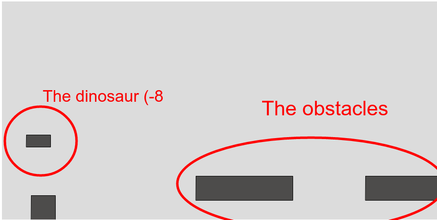

# GeneticDinosaur
A Neuroevolutive algorithm that makes Google dinosaur to learn how to play. 

# The game
A Javascript game of Google dinosaur, using p5.js and p5.collide2D (https://github.com/bmoren/p5.collide2D) libraries. *Squares are shown instead of Google dinosaur images. This is only a representation of original game*. 

# The algorithm 
Genetic algorithm parameters as well as the initial neural network topology were chosen by hand. Neural network weights are learnt via reinforcement learning by running the algorithm several generations. Results say that the algorithm learns the weights in approximately 30 generations. *This is only the code repository, no formal results are provided*. 

# Screenshot

   